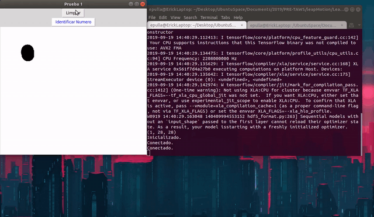

leapMotion
==========

Version 2.0 19-08-2019
----------------------

# Instalación leapMotion
1. Descargar el sdk o buscar el archivo Leap-2.3.1+31549-xYY.deb deacuerdo a su computadora.

    x86
    x64

2. Instalar
```
	sudo dpkg --install Leap-*-xYY.deb
```
3.- en caso de errores:  
```
    sudo nano /lib/systemd/system/leapd.service
    leapd.service file:
    [Unit]
    Description=LeapMotion Daemon
    After=syslog.target

    [Service]
    Type=simple
    ExecStart=/usr/sbin/leapd

    [Install]
    WantedBy=multi-user.target

    sudo ln -s /lib/systemd/system/leapd.service /etc/systemd/system/leapd.service
    sudo systemctl daemon-reload
    sudo dpkg --install Leap-2.3.1+31549-x64.deb
```

# Configuración leapMotion
1. Abrir una terminal y ejecutar servicio del leap motion con el siguiente comando.	
```
	sudo leapd
```
2. Abrir otra terminal y ejecutar el panel de control que ofrece leap motion
```
	sudo LeapControlPanel
```


# Instalación dependencias para ejecutar demos
1. Ejecutar solo una vez.
```
sudo apt-get install scrot
virtualenv --python=python2 env
cd leapMotion/
source env/bin/activate
pip install -r requirements.txt
```

# Demos desarrolladas para el leap motion

* Ejecutar demo pizarra
-----------------------

1. Abrir una terminal y ejecutar servicio del leap motion con el siguiente comando.	
```
	sudo leapd
```

2. Abrir otra terminal 
```
	source env/bin/activate
	cd leapMotion/LeapSDK_mauricio/leap_motion/src/
```

3. Ejecutar script de pizarra
```
	python pizarra.py
```

Capturas demo pizarra
---------------------


----------------------------------
### Autores ###
* Karina Saylema [github](https://github.com/karissay)
* Erick Pulla [github](https://github.com/epulla)

1. Abrir una terminal y ejecutar servicio del leap motion con el siguiente comando.	
```
	sudo leapd
```

1. Abrir otra terminal y ejecutar
```
	source env/bin/activate
	cd leapMotion/LeapSDK_mauricio/leap_motion/src/
```

2. Ejecutar script de predicción
```
	python prediccion.py
```
Capturas demo predicción digitos
--------------------------------


## Re-entrenamiento

El modelo puede predecir incorrectamente lo que el usuario esta dibujando. Para esto, el programa le permite al usuario ingresar el número que intentó dibujar y así, *re-entrenar* el modelo para obtener una nueva predicción y mejorandolo para futuras predicciones.

El programa muestra el # de intentos de entrenamiento que hizo hasta predecir el resultado deseado por el usuario.

Predicción fallida (antes) | Predicción mejorada (después)
--- | --- |
 | 
